<h1 align="center">Kook-Afd-Webhook-Bot</h1>

  
 

## 1.简介

本文档主要讲解如何将kook机器人与爱发电的webhook功能进行对接

> 商品以vip作为示例，提供一个基础的python-demo

主要流程如下

* 机器人提供vip商城命令，用户执行，机器人发送一张包含不同价位vip价格和购买url的卡片给用户（临时消息，只有这个用户能看到）
* 用户购买商品时，爱发电发送webhook给机器人
* 机器人获取webhook信息中的`custom_order_id`，解析出用户id和购买天数，自动给对应用户上vip

相关文档

* 机器人所用框架：[github.com/TWT233/khl.py](https://github.com/TWT233/khl.py)
* 爱发电webhook接口文档：https://afdian.net/p/9c65d9cc617011ed81c352540025c377

开始前，你需要先拥有自己的[kook-bot](https://developer.kookapp.cn/doc/intro)，并注册[爱发电](https://afdian.net/)，申请爱发电开发者权限

> 如果你想使用CDK（即兑换码）的方式来分发vip，可以看看我的 [Valorant-Shop-CN/Kook-Valorant-Bot](https://github.com/Valorant-Shop-CN/Kook-Valorant-Bot) 项目

## 2.python-demo

### 2.1 webhook-api

要想和爱发电的api对接，首先bot自己需要维护一个webhook的api-url。这也要求你的机器人是部署在**可公网访问**的环境中，否则爱发电的webhook无法送达。

* 爱发电开发者页面 https://afdian.net/dashboard/dev
* 该url必须为https协议，所以你还需要绑定域名并配置ssl

同时，为了保证webhook中始终有`custom_order_id`字段，您需要告知您的用户，只能通过机器人生成的url来购买vip。否则自动化流程将失效

* 机器人收到爱发电webhook
* 解析webhook中的键值，获取到`custom_order_id`
* 解析`custom_order_id`，获取到kook用户id和vip天数
* 给用户添加上vip天数

~~~python
custom_order_id=kook用户id:vip天数
~~~

处理代码详见 [api.py](./api.py) 和 [apiHandler.py](./utils/apiHandler.py)

### 2.2 机器人

机器人命令如下

| 命令      | 说明                                           |
| --------- | ---------------------------------------------- |
| /shop     | 获取购买vip的卡片                              |
| /vip      | 看看自己vip剩余时长                            |
| /vip-l    | 获取vip用户列表（会刷掉过期的vip用户）         |
| /vip-test | 该命令只有vip用户才能执行，用于测试vip是否生效 |
| /alive    | 看看机器人活着不                               |
| /kill     | 机器人下线，并保存文件                         |

代码详见 [main.py](./main.py)

#### 2.2.1 vip物品url获取

先创建你的vip店铺。爱发电的商品有`隐藏`功能，隐藏后的商品将不会显示在主页上，这样也能实现用户只能通过bot提供的链接来访问购买的操作

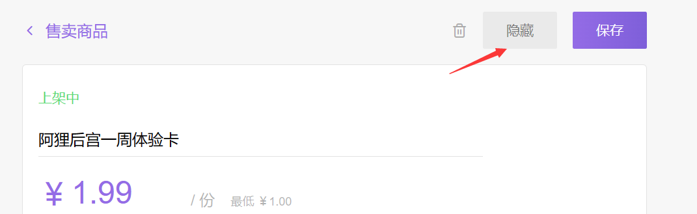

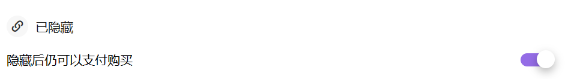

这里我拿周vip和月vip作为示例

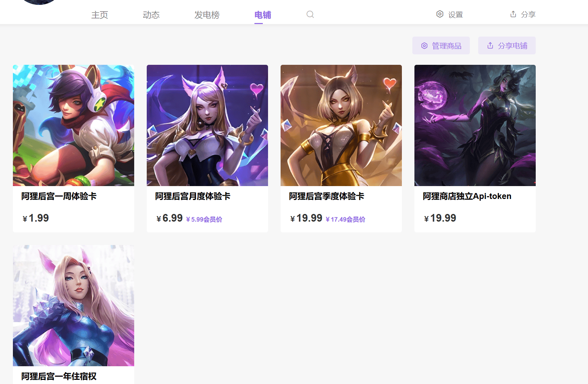

点击商品，进入详情页，点击发电

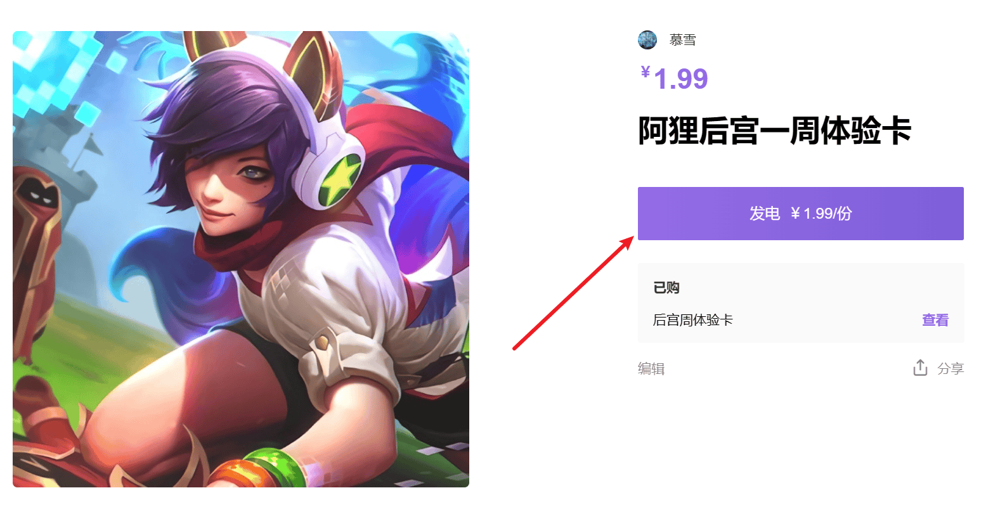

进入付款页面后，复制最上方的url

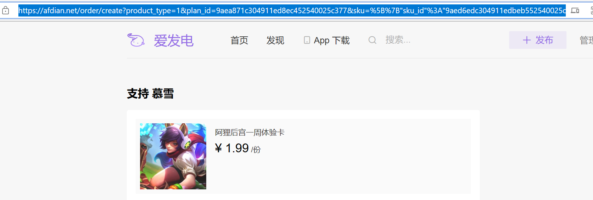

~~~
https://afdian.net/order/create?product_type=1&plan_id=9aea871c304911ed8ec452540025c377&sku=%5B%7B%22sku_id%22%3A%229aed6edc304911edbeb552540025c377%22,%22count%22%3A1%7D%5D
~~~

我们要做的就是在这个url尾部添加上`custom_order_id`

~~~
&custom_order_id=kook用户id:vip天数
~~~

添加完毕后的链接如下

~~~
https://afdian.net/order/create?product_type=1&plan_id=9aea871c304911ed8ec452540025c377&sku=%5B%7B%22sku_id%22%3A%229aed6edc304911edbeb552540025c377%22,%22count%22%3A1%7D%5D&custom_order_id=kook用户id:vip天数
~~~

复制到浏览器，仍可正常访问，代表配置无误

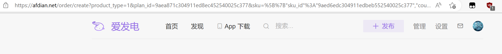

#### 2.2.2 vip物品url配置

找到`main.py`中的如下代码，将里面的`vip_item_link`替换成你自己的url。如果需要添加更多商品，将两个`----------`中间的部分多复制几份即可

~~~python
@bot.command(name='shop',case_sensitive=False)
async def shop_cmd(msg:Message,*arg):
    logMsg(msg)
    try:
        cm = CardMessage()
        c =Card(Module.Section(Element.Text("欢迎选购机器人Vip",Types.Text.KMD)))
        ## -------------
        ## vip商品1,周vip
        vip_item_link1 = "https://afdian.net/order/create?product_type=1&plan_id=9aea871c304911ed8ec452540025c377&sku=%5B%7B%22sku_id%22%3A%229aed6edc304911edbeb552540025c377%22,%22count%22%3A1%7D%5D"
        ## 添加上自定义订单号的字符串
        vip_item_link1+= f"&custom_order_id={msg.author_id}:7"
        c.append(
            Module.Section(
                Element.Text("周vip", Types.Text.KMD),
                Element.Button("购买", vip_item_link1, Types.Click.LINK)))
        ## -------------
        
        ## vip商品2,月vip
        vip_item_link2 = "https://afdian.net/order/create?product_type=1&plan_id=ff2949022e9611ed89d452540025c377&sku=%5B%7B%22sku_id%22%3A%22ff2bb4f82e9611ed83ac52540025c377%22,%22count%22%3A1%7D%5D"
        ## 添加上自定义订单号的字符串
        vip_item_link2+= f"&custom_order_id={msg.author_id}:30"
        c.append(
            Module.Section(
                Element.Text("月vip", Types.Text.KMD),
                Element.Button("购买", vip_item_link2, Types.Click.LINK)))
        
        cm.append(c)
        await msg.reply(cm,is_temp=True) ## 临时消息，所以这个按钮只有当前用户可以点
    except:
        _log.exception(f"Err in shop")
~~~

#### 2.2.3 启动机器人并配置webhook

先安装依赖项（Python版本3.10）

~~~
pip3.10 install -r requierments.txt
~~~

* 配置文件示例`config/config.exp.json`
* 在内部填写正确的机器人token字段后，重命名为`config.json`
* 并将`config/log.exp`中的两个文件复制到`log/`路径下

然后启动机器人

~~~
python3.10 start.py
~~~

看到如下输出即为启动成功

我们需要将api的地址填写到爱发电的webhook url中

* 开发者页面 https://afdian.net/dashboard/dev

记得开放对应端口防火墙，并正确绑定域名和开启https

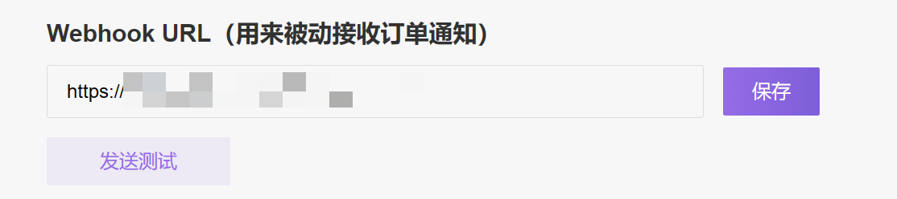

填写url后点击保存，爱发电会发送一条测试webhook给你的机器人。如果在预先定义的debug_ch中看到了如下卡片，则代表webhook配置成功

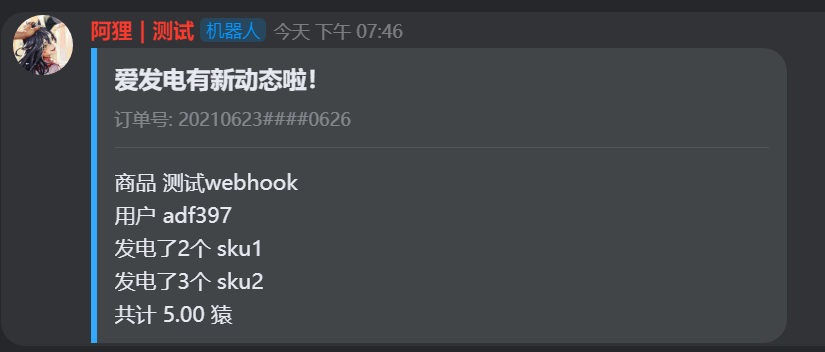

~~~
[23-04-19 19:46:07] INFO:api.py:aifadian_webhook:31 | request | /afd
[23-04-19 19:46:07] INFO:apiHandler.py:afd_request:71 | trno:202106232138371083454010626 | afd-cm-send
~~~

kill掉机器人后，在log文件中也能看到这次测试webhook的请求体

### 2.3 命令截图

#### 2.3.1 基础测试

先测试一下机器人上线没有

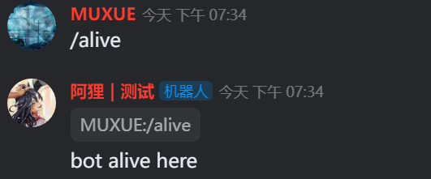

刚开始时，没有vip用户

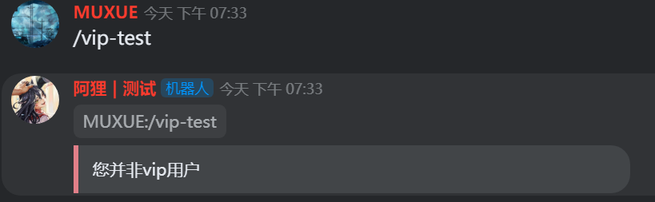

使用商城命令，获取购买按钮

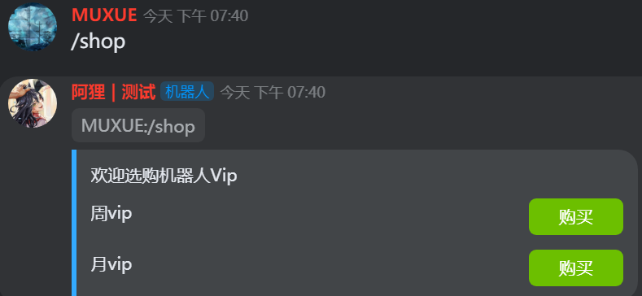

点击按钮，会跳转到爱发电的付款页面，能看到url最后成功附着上了用户id和时间

~~~
&custom_order_id=1961572535%3A7
~~~

url中的`%3A`就是`:`

----

#### 2.3.2 购入vip测试

如下，我购买了一个周vip，机器人成功获取到了webhook体中的自定义订单id

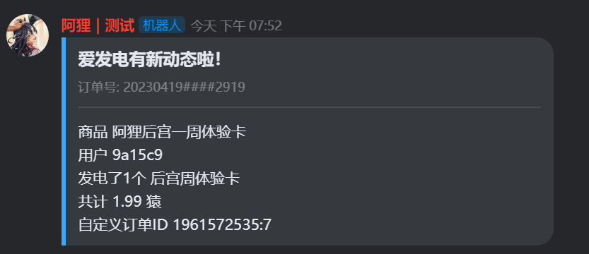

此时再次执行vip命令，能看到已经正确添加上了7天的vip

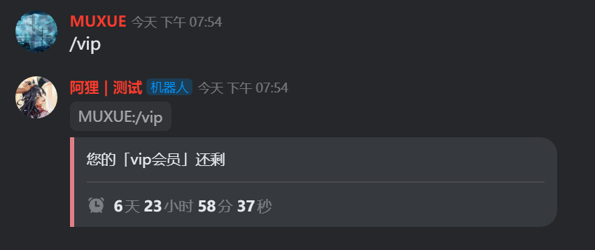

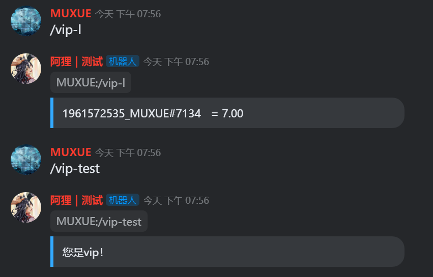

日志文件也成功记录

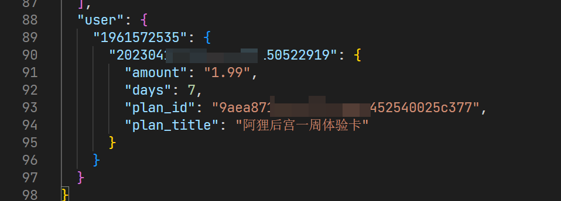

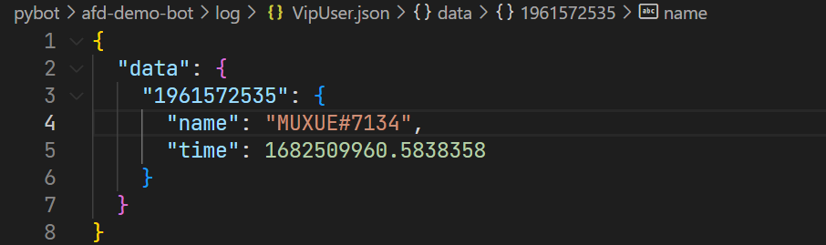

测试完毕！

## The end

有任何问题，都可以加入我的[帮助服务器](https://kook.top/gpbTwZ)与我联系

